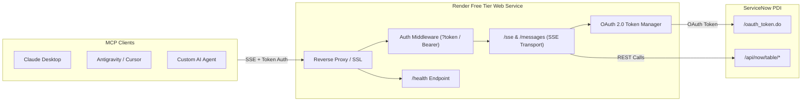

# ServiceNow PDI Model Context Protocol (MCP) Server

A production-grade, secure **Model Context Protocol (MCP)** server built in TypeScript that connects LLM clients (Claude Desktop, Google Antigravity, Cursor, etc.) to your **ServiceNow Personal Developer Instance (PDI)** via the official ServiceNow REST Table API and OAuth 2.0.

Engineered specifically for zero-cost deployment on the **Render Free Tier plan** with Server-Sent Events (SSE) transport, health checks, and connection keep-alives.

---

## 🌟 Key Features

- **Designed for Render Free Tier**: Optimized for low memory (< 80MB idle, well below Render's 512MB RAM free limit), fast cold-starts, and zero infrastructure cost.
- **Enterprise-Grade OAuth 2.0 & Auto-Refresh**: Connects to ServiceNow via OAuth 2.0 (`client_credentials` or `password` grant) with intelligent token caching and automatic refresh before expiration.
- **Robust Endpoint Security**: Secures public internet SSE endpoints (`/sse` and `/messages`) via Bearer token headers (`Authorization: Bearer <key>`) or URL query parameters (`?token=<key>`).
- **Comprehensive ServiceNow Toolset (25 Tools)**:
  - 🎫 **Incident Management**: Create, search, retrieve, update, and resolve incidents.
  - 🔄 **Change Management**: Create normal/standard/emergency change requests with implementation and backout plans.
  - 🔍 **Problem Management**: Log problems, record root causes, and track workarounds.
  - 📚 **Knowledge Base**: Search published articles and retrieve article content.
  - 👥 **Users & Groups**: Search user records, look up contact info, search assignment groups, and inspect group members.
  - ⚡ **Generic Table API**: Full access to query, read, create, update, and delete records on **any** ServiceNow table (e.g., `cmdb_ci`, `sc_req_item`, `sys_audit`, etc.).
  - 🩺 **Connection Health**: Real-time diagnostic tool (`sn_health_check`) reporting PDI latency and status.
- **Multi-Client SSE Architecture**: Supports concurrent client sessions without memory leaks or state collision.
- **Hibernation Detection**: Automatically alerts when your ServiceNow PDI is hibernating or waking up.

---

## 🏗️ Architecture



---

## 📋 Prerequisites

1. A **ServiceNow Personal Developer Instance (PDI)** from [developer.servicenow.com](https://developer.servicenow.com).
2. A free account on [Render.com](https://render.com).
3. Node.js 18+ installed locally (for local development or testing).

---

## 🔑 ServiceNow PDI Setup (OAuth 2.0)

Follow these steps to generate the OAuth credentials on your ServiceNow PDI:

1. **Log in to your PDI**: Navigate to `https://devXXXXX.service-now.com` and log in as System Administrator.
2. **Open Application Registry**: In the left filter navigator, search for **Application Registry** (under *System OAuth*).
3. **Create New Endpoint**:
   - Click the **New** button.
   - Select **Create an OAuth API endpoint for external clients**.
4. **Configure Endpoint**:
   - **Name**: e.g., `Render MCP Server`
   - **Client ID**: (ServiceNow generates this automatically, or enter your own)
   - **Client Secret**: Enter a secure password/secret (or leave empty to let ServiceNow generate one; **copy it immediately** upon saving).
   - **Refresh Token Lifespan**: `8,640,000` (100 days)
   - **Access Token Lifespan**: `1,800` (30 minutes)
   - **Active**: Checked (true)
5. **Click Submit / Update**:
   - Save your **Client ID** and **Client Secret**.

> [!NOTE]
> If using `client_credentials` grant, ensure your ServiceNow instance allows client credentials without redirect URLs. If your PDI requires user context, set `SERVICENOW_OAUTH_GRANT_TYPE=password` and supply your `admin` username and password in the environment variables.

---

## 🚀 Deployment to Render (Free Tier)

### Method 1: 1-Click Blueprint Deploy (`render.yaml`)

1. Push this repository to your GitHub or GitLab account.
2. In the [Render Dashboard](https://dashboard.render.com), click **New +** and select **Blueprint**.
3. Connect your repository. Render will automatically detect the [`render.yaml`](file:///c:/Jason%20Antigravity/AG_MCP/render.yaml) file.
4. Render will prompt you to fill in the required environment variables:
   - `SERVICENOW_INSTANCE_URL`: `https://devXXXXX.service-now.com`
   - `SERVICENOW_CLIENT_ID`: Your OAuth Client ID
   - `SERVICENOW_CLIENT_SECRET`: Your OAuth Client Secret
   - `MCP_API_KEY`: Render will **automatically generate** a secure random 32-character key for you! (Copy it from the dashboard environment settings).
5. Click **Apply**. Render will install dependencies, build TypeScript (`npm run build`), and launch the service (`npm start`).

---

### Method 2: Manual Web Service Setup

If you prefer to configure the Web Service manually:

1. In the Render Dashboard, click **New +** -> **Web Service**.
2. Connect your Git repository.
3. Configure the following fields:
   - **Name**: `servicenow-mcp-server`
   - **Language / Runtime**: `Node`
   - **Plan**: `Free`
   - **Build Command**: `npm install && npm run build`
   - **Start Command**: `npm start`
   - **Health Check Path**: `/health`
4. In the **Environment Variables** tab, add:

| Key | Example Value | Description |
| :--- | :--- | :--- |
| `PORT` | `10000` | Render assigns this automatically |
| `MCP_API_KEY` | `super_secure_random_key_123` | Secret token to authenticate MCP client requests |
| `SERVICENOW_INSTANCE_URL` | `https://dev12345.service-now.com` | Your ServiceNow PDI base URL |
| `SERVICENOW_AUTH_TYPE` | `oauth` | `oauth` (recommended) or `basic` |
| `SERVICENOW_OAUTH_GRANT_TYPE` | `client_credentials` | `client_credentials` or `password` |
| `SERVICENOW_CLIENT_ID` | `abc123...` | ServiceNow OAuth Client ID |
| `SERVICENOW_CLIENT_SECRET` | `secret...` | ServiceNow OAuth Client Secret |
| `SERVICENOW_USERNAME` | `admin` | (Only needed if `password` grant or `basic` auth) |
| `SERVICENOW_PASSWORD` | `your_pdi_password` | (Only needed if `password` grant or `basic` auth) |

5. Click **Create Web Service**. Once deployed, Render will provide your public URL:
   `https://<your-service-name>.onrender.com`

---

## ⏰ Render Free Tier Sleep & Keep-Alive Setup

On Render's Free plan, Web Services spin down after **15 minutes of inactivity**. The next incoming request triggers a spin-up that takes ~30-50 seconds (cold start).

### Keeping the Server Warm (Recommended)
To prevent your MCP server from sleeping while you work:
1. Go to a free monitoring service like [UptimeRobot](https://uptimerobot.com) or [cron-job.org](https://cron-job.org).
2. Create a new **HTTP(s) Monitor**:
   - **URL**: `https://<your-service-name>.onrender.com/health`
   - **Monitoring Interval**: Every `10 minutes`
   - **HTTP Method**: `GET`
3. Because `/health` is unauthenticated and lightweight, it will ping your Render service every 10 minutes, keeping it active with zero cold-start delay!

---

## 🔌 Connecting to Your MCP Server

### 1. Claude Desktop Setup
Edit your `claude_desktop_config.json`:
- **macOS**: `~/Library/Application Support/Claude/claude_desktop_config.json`
- **Windows**: `%APPDATA%\Claude\claude_desktop_config.json`

Add the server to your `mcpServers` object:

```json
{
  "mcpServers": {
    "servicenow": {
      "command": "npx",
      "args": [
        "-y",
        "mcp-remote-client",
        "https://<your-service-name>.onrender.com/sse?token=YOUR_MCP_API_KEY"
      ]
    }
  }
}
```

Or using standard native SSE config in supported MCP clients:

```json
{
  "mcpServers": {
    "servicenow": {
      "url": "https://<your-service-name>.onrender.com/sse?token=YOUR_MCP_API_KEY",
      "headers": {
        "Authorization": "Bearer YOUR_MCP_API_KEY"
      }
    }
  }
}
```

### 2. Google Antigravity Setup
Add the server definition into your workspace or global `mcp_config.json`:

```json
{
  "mcpServers": {
    "servicenow": {
      "serverUrl": "https://<your-service-name>.onrender.com/sse?token=YOUR_MCP_API_KEY"
    }
  }
}
```

### 3. Cursor Setup
Add to your project's `.cursor/mcp.json`:

```json
{
  "mcpServers": {
    "servicenow": {
      "url": "https://<your-service-name>.onrender.com/sse?token=YOUR_MCP_API_KEY"
    }
  }
}
```

---

## 🛠️ Complete Tools Reference (25 Tools)

### 🩺 System & Health
| Tool | Description |
| :--- | :--- |
| `sn_health_check` | Pings the ServiceNow instance and returns connection status, latency, and auth state. |

### 🎫 Incident Management
| Tool | Description | Key Parameters |
| :--- | :--- | :--- |
| `sn_create_incident` | Create a new incident ticket. | `short_description`, `description`, `urgency`, `impact`, `caller_id`, `category`, `assignment_group` |
| `sn_get_incident` | Retrieve incident details. | `identifier` (e.g. `INC0010001` or `sys_id`), `fields` |
| `sn_search_incidents` | Search and filter incidents. | `query`, `active`, `state`, `priority`, `assigned_to`, `assignment_group`, `limit` |
| `sn_update_incident` | Update an existing incident. | `identifier`, `work_notes`, `comments`, `state`, `assigned_to`, `urgency`, `impact` |
| `sn_resolve_incident` | Resolve an incident. | `identifier`, `close_code`, `close_notes`, `work_notes` |

### 🔄 Change Management
| Tool | Description | Key Parameters |
| :--- | :--- | :--- |
| `sn_create_change_request` | Create a change request. | `type` (`normal`/`standard`/`emergency`), `short_description`, `justification`, `implementation_plan`, `backout_plan`, `test_plan` |
| `sn_get_change_request` | Retrieve change details. | `identifier` (e.g. `CHG0030001` or `sys_id`), `fields` |
| `sn_search_change_requests` | Search/list change requests. | `type`, `state`, `priority`, `query`, `limit` |
| `sn_update_change_request` | Update change request. | `identifier`, `state`, `work_notes`, `plans`, `schedule` |

### 🔍 Problem Management
| Tool | Description | Key Parameters |
| :--- | :--- | :--- |
| `sn_create_problem` | Log a new problem record. | `short_description`, `description`, `workaround`, `cause_notes`, `urgency`, `impact` |
| `sn_get_problem` | Retrieve problem details. | `identifier` (e.g. `PRB0040001` or `sys_id`), `fields` |
| `sn_search_problems` | Search problem records. | `state`, `priority`, `active`, `query`, `limit` |
| `sn_update_problem` | Update problem and notes. | `identifier`, `workaround`, `cause_notes`, `resolution_code`, `resolution_notes` |

### 📚 Knowledge Base
| Tool | Description | Key Parameters |
| :--- | :--- | :--- |
| `sn_search_knowledge_articles` | Search published KB articles. | `keyword`, `topic`, `category`, `limit` |
| `sn_get_knowledge_article` | Get full article content and HTML. | `identifier` (e.g. `KB0010001` or `sys_id`), `fields` |

### 👥 Users & Groups
| Tool | Description | Key Parameters |
| :--- | :--- | :--- |
| `sn_search_users` | Search users in `sys_user`. | `search_term` (name, username, email), `active`, `limit` |
| `sn_get_user` | Get full user profile. | `identifier` (`sys_id`, `user_name`, or `email`), `fields` |
| `sn_search_groups` | Search assignment groups. | `search_term`, `active`, `limit` |
| `sn_get_group_members` | List members of an assignment group. | `group_identifier` (group name or `sys_id`), `limit` |

### ⚡ Generic ServiceNow Table API
| Tool | Description | Key Parameters |
| :--- | :--- | :--- |
| `sn_query_table` | Query **any** table (e.g., `cmdb_ci`, `sc_req_item`). | `table_name`, `query`, `limit`, `offset`, `fields`, `display_value` |
| `sn_get_record` | Retrieve single record from any table. | `table_name`, `sys_id`, `fields`, `display_value` |
| `sn_create_record` | Insert record into any table. | `table_name`, `data_json` |
| `sn_update_record` | Update record in any table. | `table_name`, `sys_id`, `data_json` |
| `sn_delete_record` | Delete record from any table. | `table_name`, `sys_id` |

---

## 💻 Local Development & Testing

### 1. Setup Local Environment
Clone the repository and install dependencies:
```bash
npm install
```

Copy `.env.example` to `.env` and fill in your credentials:
```bash
cp .env.example .env
```

### 2. Verify ServiceNow Connection Directly
Test your ServiceNow credentials, OAuth token generation, and query retrieval from the command line:
```bash
npm run test:auth
```

### 3. Run MCP Protocol Integration Test
Run a full end-to-end integration test that simulates an MCP client connecting via SSE, discovering all tools, and executing test calls:
```bash
npm run test:client
```

### 4. Start Local Development Server
Launch the server in watch mode:
```bash
npm run dev
```

The server will be accessible at:
- **SSE Stream**: `http://localhost:3000/sse?token=YOUR_KEY`
- **Health Check**: `http://localhost:3000/health`

---

## 📄 License

MIT License. Feel free to customize and extend for your workflows!
